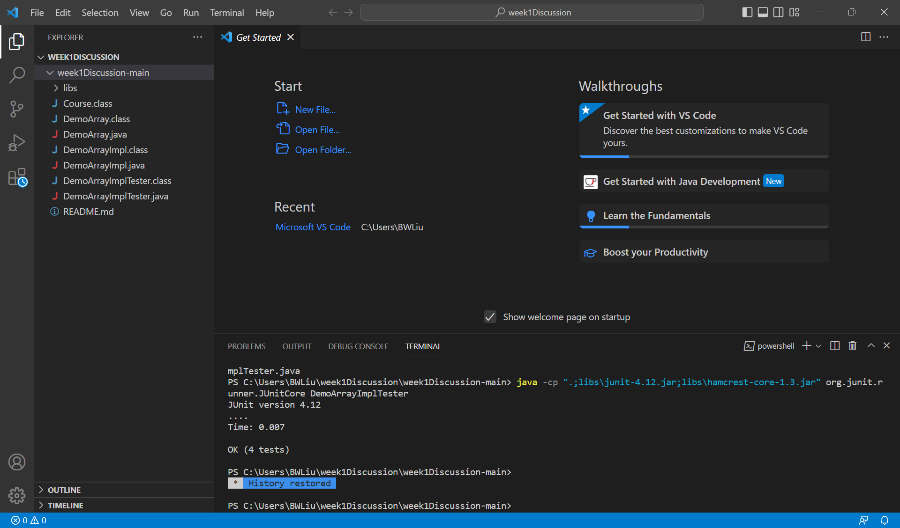
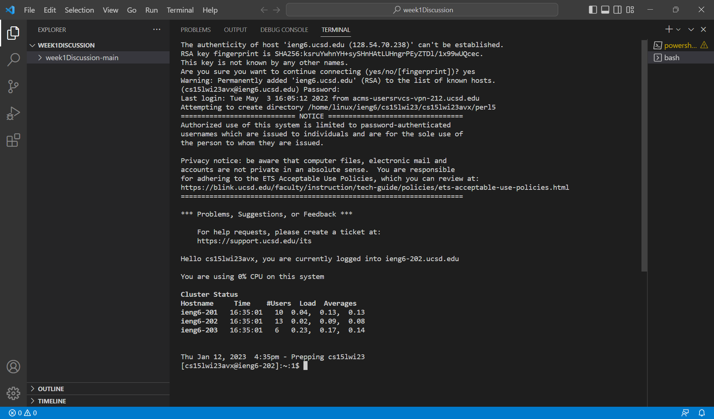
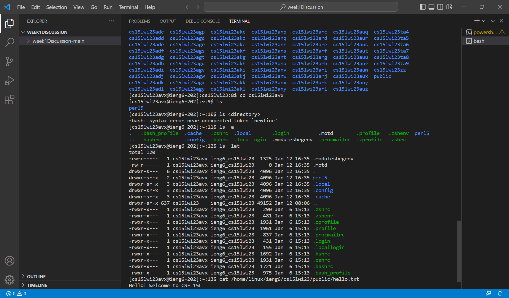

# Lab 1 Report
## Brian Liu 4:00 PM Thursday

Welcome to CSE 15L! Here are some steps on logging into your remote course-specific account on ieng6.

**Step 1** 

Make sure you've installed VScode on your computer.

If you don't already have it, install it here: 
[VSCode Install](https://code.visualstudio.com/download)

Open up the text editor, you should see something like this:

**Step 2**

Make sure you have Git installed on your computer.
[Git Installation](https://gitforwindows.org/)

Then, set your VSCode default terminal to use git bash.
[Set VSCode terminal to Bash](https://stackoverflow.com/a/50527994)

Type in this in your terminal (replace "cs15lwi23zz" with your own course-specific account name)

$ ssh cs15lwi23zz@ieng6.ucsd.edu

You should get a message asking you if you're sure you want to connect to the server. Type in yes and then press enter.

Enter your associated password now and then press enter. Don't be surprised when the cursor doesn't move as you type the password, this is how it's designed.

Once you type in your password, you should be connected to your remote computer. 

Your screen should look something like this:

**Step 3**

Make sure everything works! Try out some terminal commands and explore the directories.

Like this:

