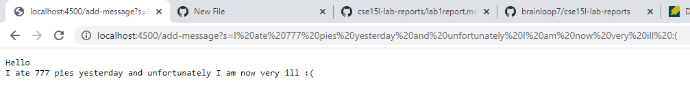
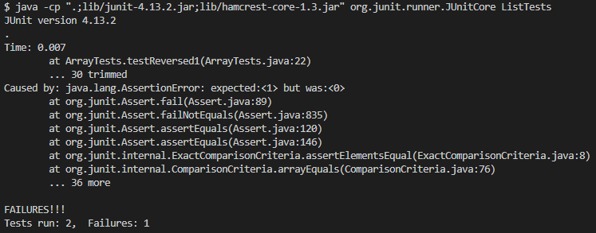

# Lab 2 Report
## Brian Liu CSE 15L 4:00 PM Thursdays

**Part 1**

Here's my code for the StringServer class:

```
class Handler implements URLHandler {
    // current string
    String currString = "";
    public String handleRequest(URI url) {
        if (url.getPath().contains("/add-message")) { 
            String[] parameters = url.getQuery().split("=");
            if (parameters[0].equals("s")) {
                if (currString.length() == 0) {
                    currString = currString.concat(parameters[1]);  
                } else {
                    currString = currString.concat("\n" + parameters[1]);  

                }
            }
        }
        return currString;
    }
}
``` 

Here's what my screen looks like after loading up the server:


As you can see, the page is blank, because currently the string is "". 

Here's what the page looks like after one call to /add-message:


In this case, after editing the URL and pressing enter, our Server class calls our HandleRequest method, which determines whether the URL additions signal an addition to
our string variable. The argument to HandleRequest is the URL itself, and within the method, it checks whether the URL contains "/add-message" and that the URL's query
starts with "s" before adding the remainder of the URL to the string. The string is updated to include whatever value (as a String) is after "s" in the URL query. 

Here's what the page looks like after a second call to /add-message:



In this case, our Server class once calls the HandleRequest method which checks to make sure the user is indeed attempting to add to the string. This time, the handling
is a bit different because our String is not empty. This time, our method adds a newline character to print the next part of the string on a new line. Again, the argument
is the URL itself, and in the end the string is updated to add the value after "s" in the URL query. 

**Part 2**

I will be referencing the bug in the reversed() method in ArrayExamples.java.

Here's an example of a test that would induce a failure from the reversed() method:

```
@Test
  public void testReversed1() {
    int[] input = {5, 4, 3, 2, 1};
    assertArrayEquals(new int[]{1,2,3,4,5}, ArrayExamples.reversed(input));
  }
```

Here's an example of a test that wouldn't induce a failure:

```
@Test
  public void testReversed() {
    int[] input1 = {};
    assertArrayEquals(new int[]{}, ArrayExamples.reversed(input1));
  }
```

Here's the symptoms of each test: 



As you can see, testReversed1() failed, while testReversed() passed.

Why's this? The problem is that arr itself is being updated and returned, rather than a new array as the method should. We can fix this by changing the 
reference to arr[i] and arr in the return statement to newArray, and by changing newArray[arr.length - i - 1] to arr[arr.length - i - 1]. This should
solve our bug because this way, a new array is created with the update values and returned, as the method is supposed to do. 

Now, let's get to fixing the reversed() method. Here's the code for the method before fixing.

```
static int[] reversed(int[] arr) {
  int[] newArray = new int[arr.length];
  for (int i = 0; i < arr.length; i += 1) {
    arr[i] = newArray[arr.length - i - 1];
  }
  return arr;
}
```

And here's the code after fixing the bug. Is this what you thought too?

```
static int[] reversed(int[] arr) {
  int[] newArray = new int[arr.length];
  for (int i = 0; i < arr.length; i += 1) {
    newArray[i] = arr[arr.length - i - 1];
  }
  return newArray;
}
```

**Part 3**

A thing I've learned over the past 2 weeks that I didn't know before is how to use GitHub desktop to keep track of code changes and then push them to Github
repositories. I learned how to clone and fork repositories, and I also learned how to utilize URLs to create programs like SearchEngine and StringServer that 
can edit webpages and variables based on what is inputted into the URL.
