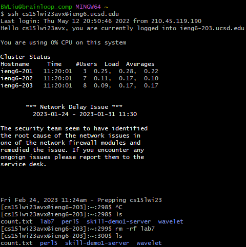
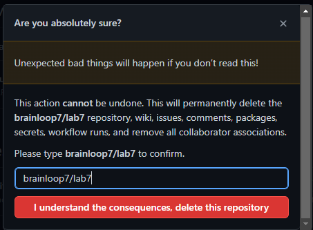
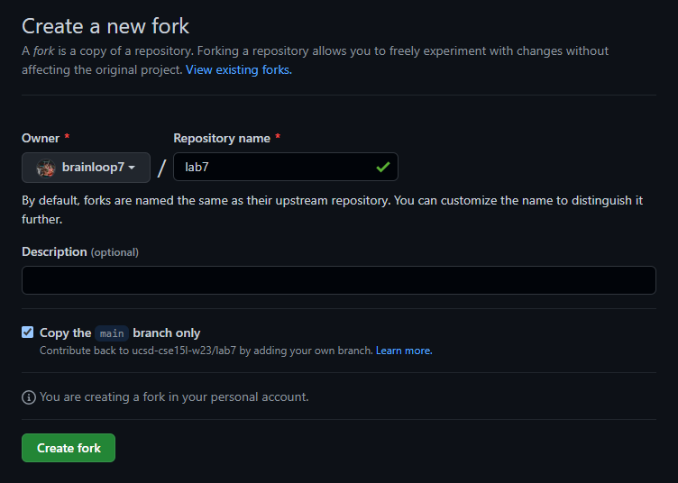
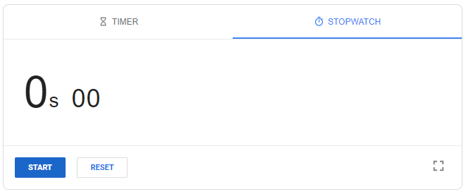
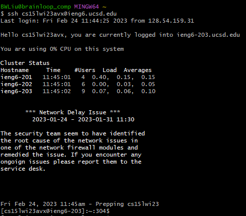
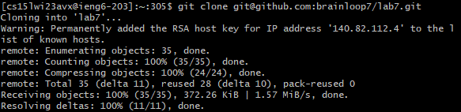
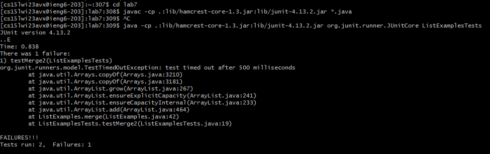
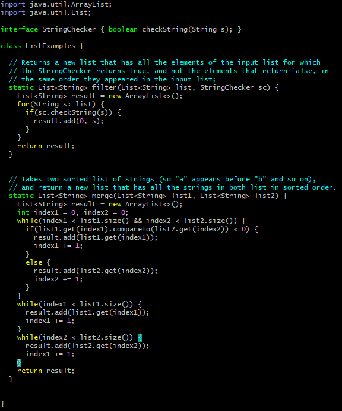
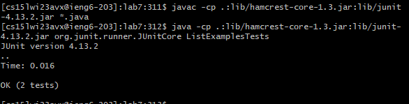

# Lab 4 Report
## Brian Liu CSE 15L 4:00 PM Thursdays

**Here's my attempt to do the following tasks as fast as possible:**

1. **Setup** Delete any existing forks of the repository you have on your account
2. **Setup** Fork the repository
3. **The real deal** Start the timer!
4. Log into ieng6
5. Clone your fork of the repository from your Github account
6. Run the tests, demonstrating that they fail
7. Edit the code file to fix the failing test
8. Run the tests, demonstrating that they now succeed
9. Commit and push the resulting change to your Github account (you can pick any commit message!)

**Step 1**

Since I've already done these tasks before, I need to delete the repository from my account so that I can properly
measure my speed and not run into problems while going through the tasks.

Using the following commands, I entered my remote server and then removed lab7 and its contents from my remote server.
I also used the ls command to double-check whether lab7 has been removed.

```
$ ssh cs15lwi23avx@ieng6.ucsd.edu
$ ls
$ rm -rf lab7
$ ls
```



Make sure to exit the remote server now!

```
exit
```

Next, to fully remove lab7 from my accounts, I went to GitHub on my browser and deleted my fork of the lab7 repository. 



**Step 2**

Now, I am going to fork the lab7 repository into my personal GitHub account. 



**Step 3**

I'm now ready to begin the actual timed tasks! Start the timer!



**Step 4**

First, I opened up my bash terminal and typed this command:

```
$ ssh cs15lwi23avx@ieng6.ucsd.edu
```

I used these shortcuts to more quickly reach the command:

```
<ctrl+r><"ssh"><enter>
```

```<ctrl+r>``` prompted the terminal to search through its command history. By typing in "ssh", the suggestion for the full command
```ssh cs15lwi23avx@ieng6.ucsd.edu``` appeared, at which point I pressed enter and the full command was executed, logging me into ieng6.



**Step 5**

Next, I cloned my fork of the lab7 repository into my remote server. 

I didn't use any shortcuts for this step. I simply typed in the following command:

``` 
git clone git@github.com:brainloop7/lab7.git
```

This command cloned my lab7 fork from my personal GitHub into my remote server.



**Step 6**

I started by entering into the lab7 repository.

```
cd lab7
```

Then, I compiled all java files within lab7. I used the following shortcuts:

```
<ctrl+r><"javac"><enter>
```

```<ctrl+r>``` prompted the terminal to search through its command history. By typing in "javac", the suggestion for the full command
```javac -cp .:lib/hamcrest-core-1.3.jar:lib/junit-4.13.2.jar *.java``` appeared, at which point I pressed enter and the full command was executed, 
compiling all the java files in lab7. 

Finally, to run the java test files, I used the following shortcuts:

```
<ctrl+r><"java"><space><enter>
```

```<ctrl+r>``` prompted the terminal to search through its command history. By typing in "java", the suggestion for the full command
```javac -cp .:lib/hamcrest-core-1.3.jar:lib/junit-4.13.2.jar *.java``` appeared, which wasn't the right one. I pressed space, and then
the correct command ```java -cp .:lib/hamcrest-core-1.3.jar:lib/junit-4.13.2.jar org.junit.runner.JUnitCore ListExamplesTests``` appeared.
At this point I pressed enter and the full command was executed, running the ListExamplesTests file.



**Step 7**

In this task, I had to edit the code in ListExamples so that it would pass the tests in ListExamplesTests. To edit the text of ListExamples
from the terminal, I used vim. 

```
vim ListExamples.java
```

After running this command, I saw this screen:



To edit the file, I pressed ```<i>``` to enter into editing mode. To fix the code, I went into the 3rd while loop in
the merge() method and changed ```index1 += 1;``` into ```index2 += 1```. Now, the code should work properly. 

To save and exit, I pressed ```<esc>``` and then typed in ```:wq```. This saves the edits of the file and then exits vim.

**Step 8**

Now, my job is to run the tests again.

First, I need to compile all the java files in lab7 again. Here's the steps I took to do this:

```
<up><up><up><enter>
```

Since ```javac -cp .:lib/hamcrest-core-1.3.jar:lib/junit-4.13.2.jar *.java``` was the 3rd most recent command, pressing
up three times got me to the needed command. Now that I've compiled the files, I need to run the tester file. Here's how
I did this:

```
<up><up><up><enter>
```

Since ```java -cp .:lib/hamcrest-core-1.3.jar:lib/junit-4.13.2.jar org.junit.runner.JUnitCore ListExamplesTests``` was the 3rd most recent command, pressing
up three times got me to the needed command. Now, the tests run correctly and there are no failures. 



**Step 9**

The final step is committing and pushing these changes to my GitHub account. To accomplish this, I execute the following commands.
I didn't use any shortcuts for these.

```
git add ListExamples.java
git commit -m "updated ListExamples"
git push
```

The first command ```git add ListExamples.java``` adds changes to ListExamples.java to the next commit. The second command
```git commit -m "updated ListExamples"``` commits all new changes that have been added to my local repository with the commit
message "updated ListExamples". Finally, ```git push``` pushes these changes from my local repository onto my online GitHub repository.

**Conclusion**

This lab helped me learn a lot about how I can save time while using the terminal. Knowing about the up arrow, ctrl+r, and many other
shortcuts will help me in the future a lot. Hopefully, with this knowledge I can avoid having to type out or remember super long 
commands.
