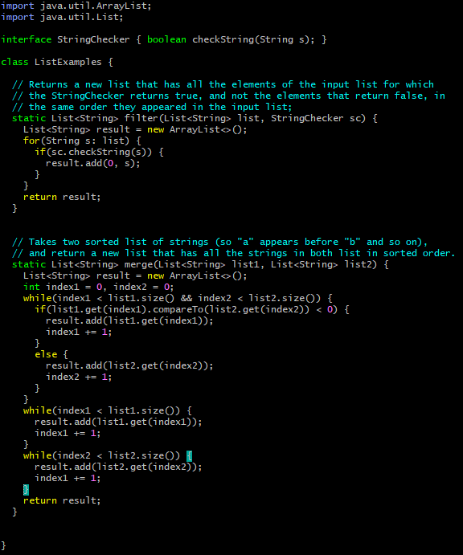

# Lab 5 Report
## Brian Liu CSE 15L 4:00 PM Thursdays

**Revisiting Lab Report 4**

Using the steps and shortcuts, I highlighted in Lab Report 4, I was able to complete the necessary tasks extremely fast! But, there's an even quicker way to complete the
tasks using a ```bash``` script.

Here's a reminder of what the tasks were:
1. **Setup** Delete any existing forks of the repository you have on your account
2. **Setup** Fork the repository
3. **The real deal** Start the timer!
4. Log into ieng6
5. Clone your fork of the repository from your Github account
6. Run the tests, demonstrating that they fail
7. Edit the code file to fix the failing test
8. Run the tests, demonstrating that they now succeed
9. Commit and push the resulting change to your Github account (you can pick any commit message!)

**Step 1**

First of all, as part of initial setup, we have to delete any existing forks of the repository from our account. We can use a ```bash``` script to speed up removal
of the repository from the remote server.

I created a ```bash``` script ```delete.sh``` that removes lab7 and its contents from the remote server. Here's the code for that script:

```
ssh cs15lwi23avx@ieng6.ucsd.edu "rm -rf lab7"
```

This script connects to the remote server and then runs the ```rm -rf lab7``` command, removing the lab7 repository from my remote server, and then exiting with ```exit```.

For the second part of this step, I manually deleted the lab7 repository from my GitHub account. If there's a way to delete this using a ```bash``` script (which I'm sure there is), 
I don't know it yet. :(


**Step 2** 

Again, I manually forked the lab7 repository from the CSE15L repository into my personal GitHub account. 


**Steps 3, 4, 5, and 6** 

Start the timer! Just kidding. First, I'm going to create a ```bash``` script that automates steps 4, 5, and 6.

I named the script ```part1.sh```. Here's the code:

```
ssh cs15lwi23avx@ieng6.ucsd.edu "git clone git@github.com:brainloop7/lab7.git; 
cd lab7; javac -cp .:lib/hamcrest-core-1.3.jar:lib/junit-4.13.2.jar *.java;
java -cp .:lib/hamcrest-core-1.3.jar:lib/junit-4.13.2.jar org.junit.runner.JUnitCore ListExamplesTests;"
```

In this script, I first connect to the remote server using ```ssh```, and then run the following commands within the quotes and separated by semicolons. The first command
```git clone``` clones the lab7 repository into the remote server from my GitHub account. The next command ```cd lab7``` changes the working directory to be the lab7
directory, so that ListExamplesTests can be accessed. The last two commands serve to compile and then run the JUnit tests in ListExamplesTests.java. After running the 
script, this should be the output, which demonstrates the failure of one test: 


**Step 7**

Now, we need to edit the faulty code in ListExamples.java so that the test no longer fails. To do this, we will use ```vim```. I did not include this in the ```bash```
script from the last few steps because ```vim``` responds in a strange way when accessed in a remote server with terminal commands. Additionally, ```vim``` requires
me to manually change the file data, so it wouldn't make sense to include it in my automated ```bash``` script.

As detailed in Lab Report 4, run the following command to access ```vim``` and edit the code:

```
$ ssh cs15lwi23avx@ieng6.ucsd.edu
$ cd lab7
$ vim ListExamples.java
```

After running this command, I saw this screen:



To edit the file, I pressed ```<i>``` to enter into editing mode. To fix the code, I went into the 3rd while loop in
the merge() method and changed ```index1 += 1;``` into ```index2 += 1```. Now, the code should work properly. 

To save and exit, I pressed ```<esc>``` and then typed in ```:wq```. This saves the edits of the file and then exits vim.

Make sure to exit the remote server after this!

```
$ exit
```

**Steps 8 and 9**

The rest of the tasks can be all completed with one ```bash``` script! I named this script ```part2.sh```. Here's the code:

```
ssh cs15lwi23avx@ieng6.ucsd.edu "cd lab7;
javac -cp .:lib/hamcrest-core-1.3.jar:lib/junit-4.13.2.jar *.java;
java -cp .:lib/hamcrest-core-1.3.jar:lib/junit-4.13.2.jar org.junit.runner.JUnitCore ListExamplesTests;
git add ListExamples.java;
git commit -m \"updated ListExamples\";
git push;"
```

In this script, I again started by connecting to the remote server with ```ssh```. Next, I compiled and ran the JUnit tests, and saw that they passed without any
failures (see picture below). Then, the last 3 commands updated my GitHub repository. ```git add``` added ListExamples.java to the next commit, ```git commit``` 
commits all new changes that have been added to my local repository with the commit message "updated ListExamples", and ```git push``` pushes these changes from my 
local repository onto my online GitHub repository.

This is what happens after I run this code:


**Conclusion**

As you can see, the creation of bash scripts has made the completion of the tasks much, much quicker. Now, using basically only 3 lines of code, I can complete all of
the tasks. Starting from where the timer starts in Step 3, I can run ```part1.sh```, then use ```vim``` to edit the contents of ListExamples.java, and finally run 
```part2.sh``` to complete the process. 


